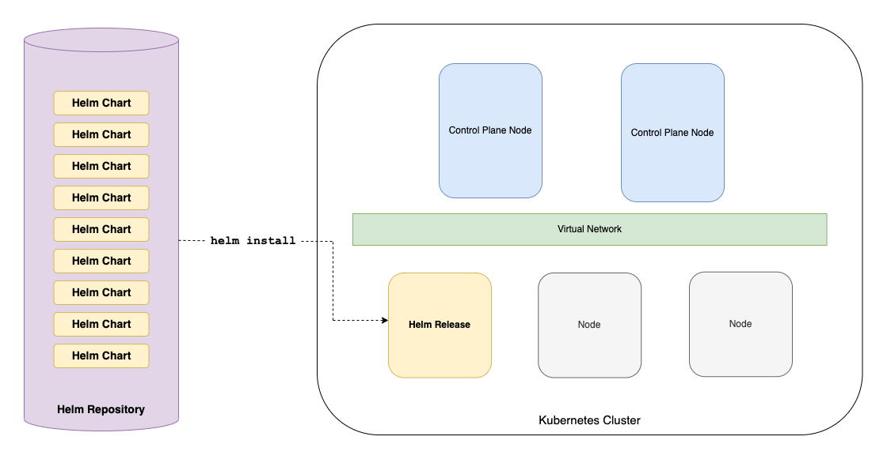

# practice-helm

This is a small practice project documenting outlining the core Helm concepts and demonstrating a basic use of the technology.

Technologies used:

- minikube: 1.25.1
- helm: v3.9.4

## Core Concepts

Helm is essentially a package manager for Kubernetes.



### Chart

A **Chart** is a Helm package, an application that has been prepared for deployment and use within a Kubernetes cluster. 

### Repository

A **Repository** is a store of Charts, and can be public or private.

### Release

A **Release** in an installed Chart. Multiple releases can be installed in a single cluster using the same Chart.

---

Helm installs **charts** into Kubernetes, creating a new **release** for each installation. New **charts** can be found by searching Helm chart **repositories**.

## Use a Helm Chart

**A Kubernetes cluster must be running on the same machine as Helm.**

First add a chart repository:

```bash
helm repo add bitnami https://charts.bitnami.com/bitnami
```

Create a release from a chart in the repository (install a chart):

```bash
helm install example-chart bitnami/mysql --generate-name
```

Get more information about a release:

```bash
helm status example-chart
```

To list the charts in a repository:

```bash
helm search repo bitnami
```

Check the releases (installed charts):

```bash
helm list
```

Uninstall a release:

```bash
helm uninstall example-chart
```

## Chart Structure

A basic chart with the core files is structured as follows:

```
|- example-chart/
|		|
|		|- Chart.yaml
|		|- values.yaml
|		|
|		|- templates/
|		|		|
|		|		|- deployment.yaml
|		|		|- service.yaml
|		|		|- ...
|		|
|
```

### Chart.yaml

This file contains the meta data for the chart, including the chart name, description, and version number.

### values.yaml

This file contains the values that will be used to fill out the files in the template directory when the chart is installed as a release in the Kubernetes cluster.

### templates/*

This directory contains the Kubernetes manifest files that will be populated by the `values.yaml` file when the chart is installed as a release in the Kubernetes cluster. Generally, it's best practice to have each file represent the required Kubernetes resource for the application.

## Create a Helm Chart

### Note:

**For demo purposes, step 2 can be skipped as Helm will create a default nginx chart.**

The default `example-chart` created by helm has been [included in this repository](example-chart/) if you'd like to see the contents.

---

1. Use the convinience `create` command to create an initial structure:

```bash
helm create example-chart
```

2. Update the files in the newly created `example-chart` directory:
   * Update the `Chart.yaml` with your application details
   * Update/add/remove files in the `templates/` directory with the configurations that will be compiled into a kubernetes manifest (without values)
   * Update the `values.yaml` file with the values required by the files in the `templates/` directory
3. Install the chart as a release in the kubernetes cluster:

```bash
helm install example-chart ./example-chart
```

4. Confirm that pod is running in the kubernetes cluster:

```bash
kubectl get pods
```

---

Helm also provides a `package` convinience command to prepare a chart for upload to a repository:

```bash
helm package ./example-chart
```

## Other Useful Helm Commands

Install a helm chart with a randomly generated name:

```bash
helm install bitnami/mysql --generate-name
```

Get the details about a release:

```bash
helm status example-chart
```

Check which values are configurable:

```bash
helm show values example-chart
```

